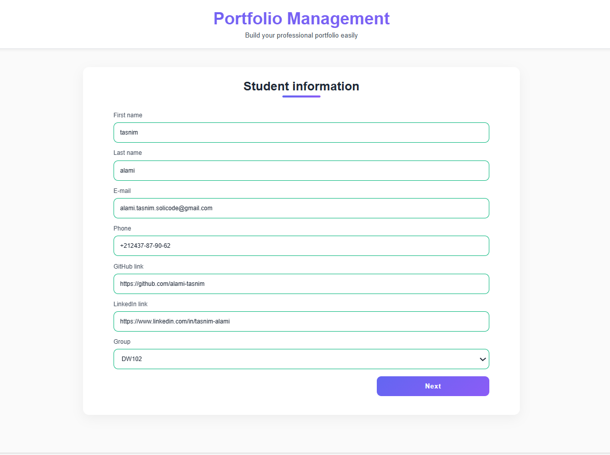
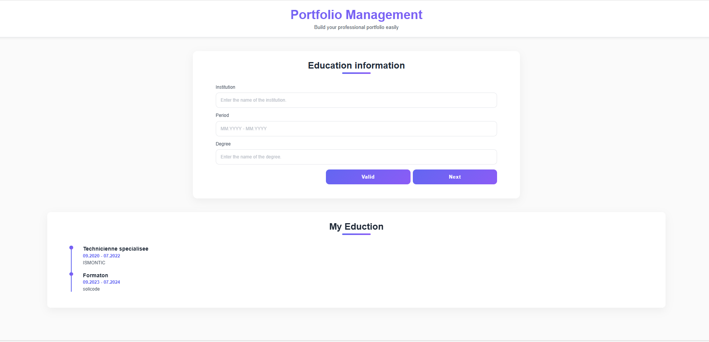
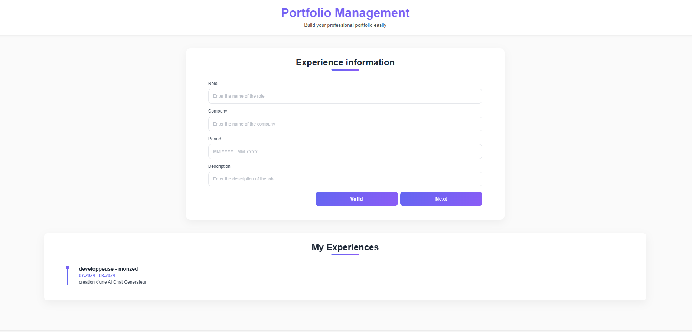
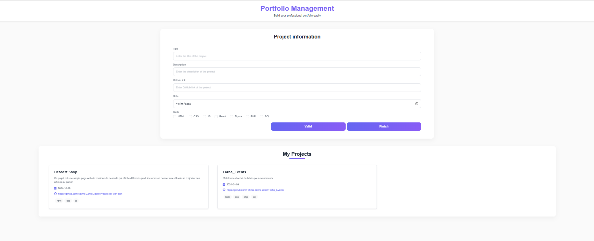
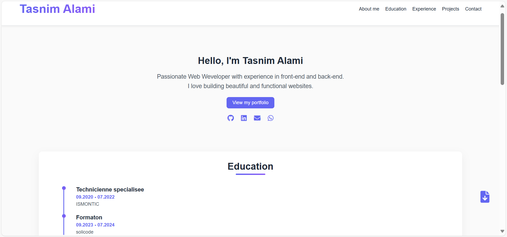
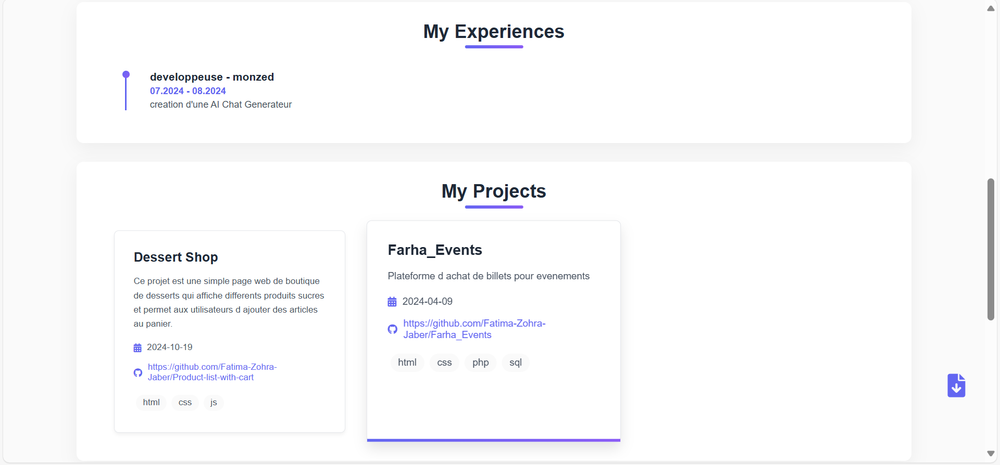
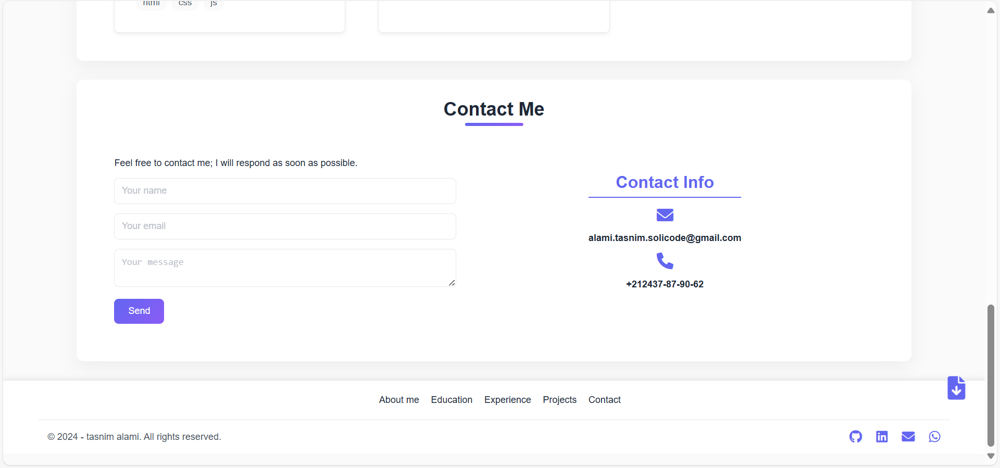

# Générateur de Portfolios — Solicode

## Objectif:
Ce projet a pour but de faciliter l’insertion professionnelle des apprenants de Solicode en leur permettant de créer rapidement un portfolio personnalisé à partir d’un modèle prédéfini.
L’application web collecte les informations des apprenants et leurs projets, puis génère automatiquement un portfolio exportable en PDF.

## Fonctionnalités principales

- **Formulaire d’inscription** : saisie des informations personnelles (Nom, Prénom, Email, Téléphone,lien GitHub, lien Linkedin, Groupe).

- **Gestion des expériences professionnelles** : ajout illimité d’expériences professionnelles avec nom du poste, entreprise, description, date de debut et de fin.

- **Gestion des projets**: ajout illimité de projets avec titre, lien GitHub, description et compétences associées.

- **Génération de portfolio** : affichage final des informations et projets sous forme de portfolio.

- **Export en PDF** : possibilité de télécharger son portfolio avec html2pdf.js.

- **Stockage LocalStorage** : conservation des données via un objet Apprenant.

## Structure de l’application

```
/Generateur-portfolios/ 
│
├── Portfolio Solicode/              # Code source
│   ├── index.html                   # Page d’accueil 
│   ├── education.html               # Page d’ajout des diplômes
│   ├── experience.html              # Page d’ajout des expériences professionnelles
│   ├── project.html                 # Page d’ajout des projets
│   ├── portfolio.html               # Page de visualisation du portfolio
│   ├── style.css                    # Styles du site
│   ├── portfolio.css                # Styles du portfolio
│   ├── script.js                    # Script principal
│   ├── images/                      # Images des desserts et icônes du panier
│
├── Screenshots/                     # Dossier contenant les captures d’écran de l’application
├── Brief_générateur_portfolio.pdf   # Brief du projet
└── README.md                        # Documentation
```

## Technologies utilisées

HTML5 / CSS3 / JavaScript

LocalStorage pour la sauvegarde des données

html2pdf.js pour l’export en PDF


## Instructions d’utilisation

Ouvrir index.html dans un navigateur.

Remplir les informations personnelles puis cliquer sur Suivant.



Ajouter un ou plusieurs diplômes puis cliquer sur Suivant.



Ajouter un ou plusieurs expériences professionnelles puis cliquer sur Suivant.



Ajouter un ou plusieurs projets puis cliquer sur Terminer.



Visualiser le portfolio et, si souhaité, l’exporter en PDF.








